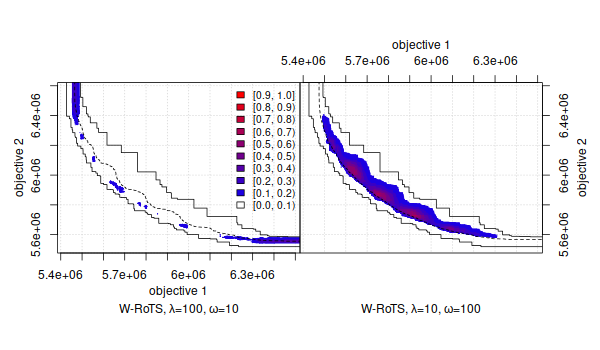

> [!CAUTION]
> This package is now obsolete and it will be archived in the future. Users should move to using either [moocore](https://multi-objective.github.io/moocore/r/) or [mooplot](https://multi-objective.github.io/mooplot/r/).



   
**eaf**: Empirical Attainment Function (EAF) Tools
================================================================

<!-- badges: start -->
[](https://cran.r-project.org/package=eaf) [](https://CRAN.R-project.org/package=eaf) [](https://github.com/MLopez-Ibanez/eaf/actions)
[](https://app.codecov.io/gh/MLopez-Ibanez/eaf?branch=master)
<!-- badges: end -->

[ [**Homepage**](https://mlopez-ibanez.github.io/eaf/) ]  [ [**GitHub**](https://github.com/MLopez-Ibanez/eaf) ]

**Maintainer:** [Manuel López-Ibáñez](https://lopez-ibanez.eu)

**Contributors:**
    [Manuel López-Ibáñez](https://lopez-ibanez.eu),
    [Marco Chiarandini](http://www.imada.sdu.dk/~marco),
    [Carlos M. Fonseca](https://eden.dei.uc.pt/~cmfonsec/),
    [Luís Paquete](https://eden.dei.uc.pt/~paquete/),
    Thomas Stützle,
    and Mickaël Binois.
    
---------------------------------------

Introduction
============

The empirical attainment function (EAF) describes the probabilistic
distribution of the outcomes obtained by a stochastic algorithm in the
objective space. This [R](https://www.R-project.org/) package implements plots
of summary attainment surfaces and differences between the first-order
EAFs. These plots may be used for exploring the performance of stochastic local
search algorithms for biobjective optimization problems and help in identifying
certain algorithmic behaviors in a graphical way.

The corresponding [book chapter](#LopPaqStu09emaa) [1] explains the use of
these visualization tools and illustrates them with examples arising from
practice.

In addition, the package provides functions for computing several quality metrics, such as hypervolume, IGD, IGD+, and epsilon.

**Keywords**: empirical attainment function, summary attainment surfaces, EAF
differences, multi-objective optimization, bi-objective optimization,
performance measures, performance assessment, graphical analysis,
visualization.

**Relevant literature:**

 1. <a name="LopPaqStu09emaa"/>Manuel López-Ibáñez, Luís Paquete, and Thomas Stützle. [Exploratory Analysis of Stochastic Local Search Algorithms in Biobjective Optimization](https://doi.org/10.1007/978-3-642-02538-9_9). In T. Bartz-Beielstein, M. Chiarandini, L. Paquete, and M. Preuss, editors, *Experimental Methods for the Analysis of Optimization Algorithms*, pages 209–222. Springer, Berlin, Germany, 2010.<br>
    (This chapter is also available in a slightly extended form as Technical Report TR/IRIDIA/2009-015).<br>
    [ [bibtex](https://lopez-ibanez.eu/LopezIbanez_bib.html#LopPaqStu09emaa) |
    doi: [10.1007/978-3-642-02538-9_9](https://doi.org/10.1007/978-3-642-02538-9_9)
    | [Presentation](https://lopez-ibanez.eu/doc/gecco2010moworkshop.pdf) ]


Download and installation
-------------------------

The **eaf** package is implemented in R. Therefore,
a basic knowledge of R is recommended to make use of all features. 

The first step before installing the **eaf** package is to [install R](https://cran.r-project.org/). Once R is installed in the system, there are two methods for installing the **eaf** package:

 1. Install within R (automatic download, internet connection required). Invoke
    R, then
    
    ```r
        install.packages("eaf")
    ```
    
 2. [Download the **eaf** package from CRAN](https://cran.r-project.org/package=eaf) (you may also need to download and install
    first the [package modeltools](https://cran.r-project.org/package=modeltools)), and invoke at the command-line:
    
    ```bash
        R CMD INSTALL <package>
    ```
    where `<package>` is one of the three versions available: `.tar.gz` (Unix/BSD/GNU/Linux), `.tgz` (MacOS X), or `.zip` (Windows).

Search the [R documentation](https://cran.r-project.org/faqs.html) if you need more help to install an R package on your system.

The code for computing the EAF is available as a C program, and it does not require installing R or any R packages.  Just [download the package source
code](https://cran.r-project.org/package=eaf), uncompress it, and look for the
directory `src/eaf`. The C code can be used to implement your own visualizations
instead of the visualizations provided by the **eaf** package. Compiled executables for computing the EAF can be found under `system.file(package="eaf", "bin")`. Other useful
executable programs can be found there.

The `eaf` package also contains two Perl scripts that may allow you to generate
standard plots without any R knowledge. See `inst/scripts/eafplot/` and
`inst/scripts/eafdiff/` in the package source code. The scripts use the **eaf**
package internally to generate the plots, and, hence, the **eaf** package must
be installed and working.


If you wish to be notified of bugfixes and new versions, please subscribe to the [low-volume emo-list](https://lists.dei.uc.pt/mailman/listinfo/emo-list), where announcements will be made.

[ [Download **eaf** package from CRAN](https://cran.r-project.org/package=eaf) ]  [ [Documentation](https://mlopez-ibanez.github.io/eaf/) ]  [ [Development version (GitHub)](https://github.com/MLopez-Ibanez/eaf) ]


GitHub (Development version)
----------------------------

If you wish to try the development version, you can install it by executing the
following commands within the R console:

```R
    R> install.packages("devtools")
    R> devtools::install_github("MLopez-Ibanez/eaf")
```

Usage
-----

Once the **eaf** package is installed, the following R commands will give more information:
```r
    library(eaf)
    ?eaf
    ?eafplot
    ?eafdiffplot
    ?read.data.sets
    example(eafplot)
    example(eafdiffplot) # This one takes some time
```

Apart from the main R package, the source code contains the following extras in
the directory `inst/` (after installation, these files can be found at the
directory printed by the R command `system.file(package="eaf")`):

 * `scripts/eafplot` : Perl script to plot summary attainment surfaces.
 * `scripts/eafdiff` : Perl script to plot the differences between the EAFs of two input sets.
 * `extdata/` : Examples of utilization of the above programs. These are discussed in the corresponding [book chapter](#LopPaqStu09emaa) [1].

In addition, the source code contains the following under `src/`:
 * `src/eaf` : This C program computes the empirical attainment function in 2
   or 3 dimensions. It is NOT required by the other programs, but it is
   provided as a useful command-line utility. This version is based on the
   original code written by Carlos M. Fonseca available at
   http://www.tik.ee.ethz.ch/pisa/. A more recent version is available at [Prof. Fonseca's website](https://eden.dei.uc.pt/~cmfonsec/software.html).
 * `src/mo-tools` : Several tools for working with multi-objective data.
 
For more information, consult the `README` files at each subdirectory.


Python
------

Thanks to [rpy2](https://rpy2.github.io/doc/latest/html/index.html), you can
use the `eaf` package from Python. A complete example would be:

```python
import os
## Uncomment this if you suffer from this bug in cffi 1.13.0
## https://bitbucket.org/rpy2/rpy2/issues/591/runtimeerror-found-a-situation-in-which-we
#os.environ['RPY2_CFFI_MODE'] = "API"

# Tested with rpy2 2.9.2-1 and 3.2.6
import numpy as np
from rpy2.robjects.packages import importr, isinstalled, PackageNotInstalledError
from rpy2.robjects import r as R
from rpy2.robjects import numpy2ri
from rpy2.robjects.vectors import StrVector
numpy2ri.activate()
from rpy2.interactive import process_revents
process_revents.start()

def install_rpackages(packages):
    if not isinstance(packages, list):
        packages = [ packages ]
    utils = importr('utils') # import R's utility package
    # Selectively install what needs to be installed.
    names_to_install = [x for x in packages if not isinstalled(x)]
    if len(names_to_install) > 0:
        print(f"Installing packages: {names_to_install}")
        utils.install_packages(StrVector(names_to_install), repos = "https://cloud.r-project.org", verbose=True)

try:
    eaf = importr("eaf")
except PackageNotInstalledError as e:
    install_rpackages("eaf")
    eaf = importr("eaf") # Retry after install

path = R('system.file(package="eaf", "extdata")')[0] + "/"
alg1 = eaf.read_data_sets_(path + "ALG_1_dat.xz")
alg1 = np.asarray(alg1)
alg2 = np.asarray(eaf.read_data_sets_(path + "ALG_2_dat.xz"))

eaf.eafplot(alg1[:, 0:2], sets=alg1[:,2])

input("Press ENTER to see next plot: ")

eaf.eafdiffplot(alg1, alg2, title_left="A", title_right="B")
```

License
--------

This software is Copyright (C) 2011-2021 Carlos M. Fonseca, Luís Paquete, Thomas
Stützle, Manuel López-Ibáñez and Marco Chiarandini.

This program is free software (software libre); you can redistribute it and/or
modify it under the terms of the GNU General Public License as published by the
Free Software Foundation; either version 2 of the License, or (at your option)
any later version.

This program is distributed in the hope that it will be useful, but WITHOUT ANY
WARRANTY; without even the implied warranty of MERCHANTABILITY or FITNESS FOR A
PARTICULAR PURPOSE. See the [GNU General Public License](http://www.gnu.org/licenses/gpl.html) for more details.

**IMPORTANT NOTE**: Please be aware that the fact that this program is released
as Free Software does not excuse you from scientific propriety, which obligates
you to give appropriate credit! If you write a scientific paper describing
research that made substantive use of this program, it is your obligation as a
scientist to (a) mention the fashion in which this software was used in the
Methods section; (b) mention the algorithm in the References section. The
appropriate citation is:

 * Manuel López-Ibáñez, Luís Paquete, and Thomas Stützle. **Exploratory Analysis of Stochastic Local Search Algorithms in Biobjective Optimization.** In T. Bartz-Beielstein, M. Chiarandini, L. Paquete, and M. Preuss, editors, *Experimental Methods for the Analysis of Optimization Algorithms*, pages 209–222. Springer, Berlin, Germany, 2010.  doi: 10.1007/978-3-642-02538-9_9

Moreover, as a personal note, I would appreciate it if you would email
`manuel.lopez-ibanez@manchester.ac.uk` with citations of papers referencing
this work so I can mention them to my funding agent and tenure committee.
